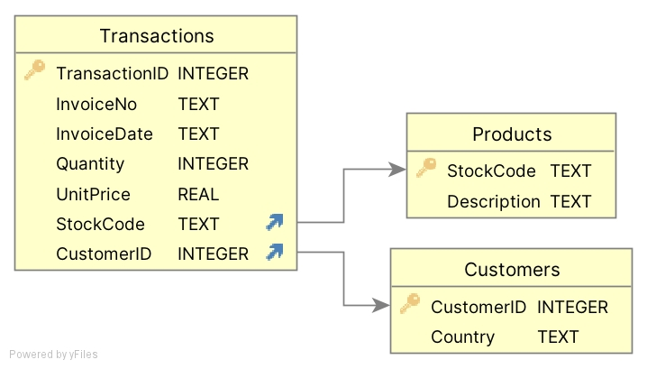

# MLOps Lecture 1 - Intro to APIs & DataBases

This repository contains lecutre slides, python scripts and dataset for the first lecture. 

## API
- **ex_jokes.py** is an example of simple public API
- **ex_finance.py**, **ex_news.py** are examples of private API using API_key (You need to register to get your private key)
- **ex_datasets.py** is an example of API Wrapper
- EXTRA: **joke_app.py** is a simple streamlit app that uses IPA to print jokes

## Database

  

- **db_create.ipynb** reads in excel file and transform it into SQL database
- **db_additional_queries.ipynb** contains a few query examples
- **db_add_rows.ipynb** add new transactions
- **db_add_columns.ipynb** add new columns
- **data/Online Retail_short.cs** is dataset used to create database (https://archive.ics.uci.edu/dataset/352/online+retail). I shortened it so it better fits our exercise. 

This is a test for Branch lecture.